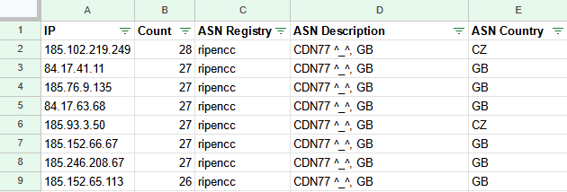

# Python IP Address Parser
Robuest python script for parsing firewall log files for the ASUS RT-AX86U

## Features
* Parses firewall logs from the ASUS RT-AX86U
  - You might need to adjust for other firewall log files
* Utilizes [IPWhoIs](https://pypi.org/project/ipwhois/) Python Package for running RDAP queries
* Counts the number of times a source IP is found
* Outputs results to an CSV
  - IP, Count, ASN Registry, ASN Description, ASN Country
* Handy [TQDM](https://tqdm.github.io/) progress bar

## Sample Output

